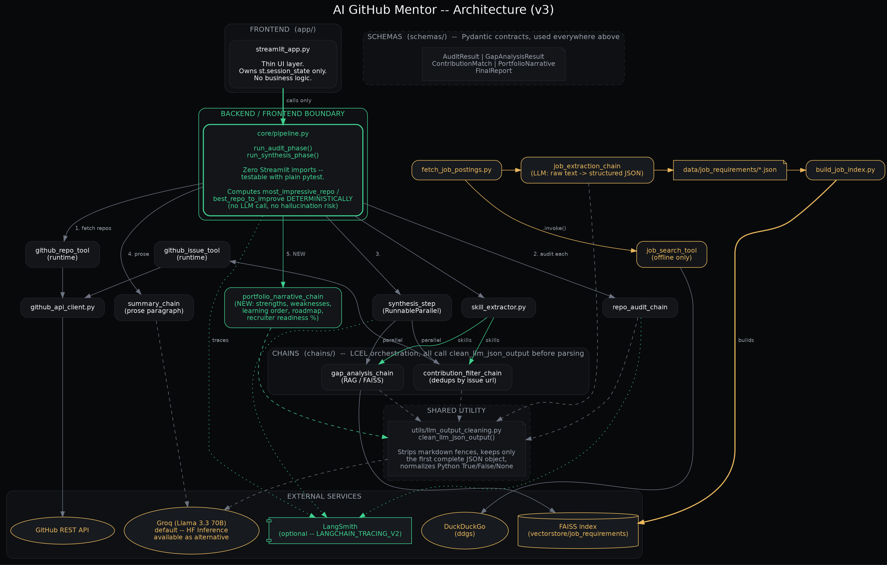
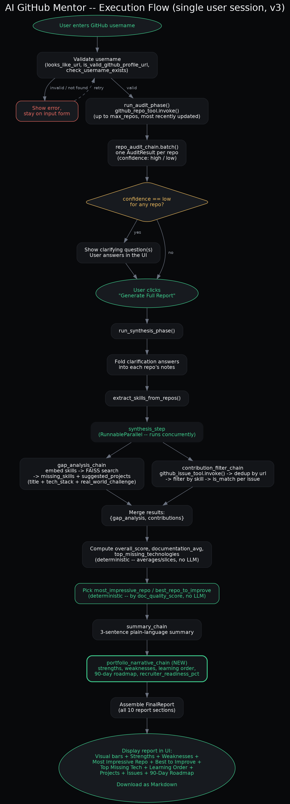

# AI GitHub Mentor

A LangChain pipeline that audits a GitHub profile's public repositories,
runs a RAG-based skill-gap analysis against real Karachi/Pakistan job
postings, and surfaces realistic open-source contribution opportunities
-- all as a single downloadable Markdown report.

## Overview

Job seekers are told to "make your GitHub good" with no specifics. This
project turns that vague advice into something concrete: it reads a
GitHub username's public repos, scores documentation and structure
quality, compares demonstrated skills against a curated set of real job
postings, and outputs a report with an honest gap analysis and a
shortlist of good-first-issues that actually match the person's current
skills.

This is a **fixed, deterministic pipeline, not an agent** -- the LLM
never decides which tool to call or what step runs next. Every step is
a predetermined stage in an LCEL chain. That's a deliberate choice: for
a project this size, a fixed pipeline is easier to reason about, easier
to test, and easier to explain in an interview than an agent would be.

## Demo / Screenshot

*(add a screenshot or a link to the deployed app here once available)*

## Architecture



The backend (`core/`, `chains/`, `tools/`, `utils/`, `schemas/`) has
**zero Streamlit imports** and is fully testable with plain `pytest` --
`app/streamlit_app.py` is a thin layer that owns exactly one thing,
`st.session_state["pipeline_state"]`, and calls into
`core/pipeline.py`'s two entry points:

- `run_audit_phase(llm, username, max_repos)` -- fetches repos and runs
  the per-repo documentation/structure audit
- `run_synthesis_phase(llm, username, repos_data, audit_results, clarification_answers, target_role, max_issues)`
  -- folds in any clarifying-question answers, runs the gap analysis
  and contribution search concurrently, and assembles the final report

### Execution flow



A single user session moves through three phases: **input** (username
+ validation), **audited** (per-repo results, clarifying questions if
any repo's confidence is low), and **done** (final report, download).
The gap-analysis and contribution-search steps run **in parallel**
(`RunnableParallel` in `chains/synthesis_step.py`), since neither
depends on the other's output.

## Knowledge Base / Data Sources

- **Job requirements**: a curated set of real Karachi/Pakistan job
  postings, fetched via `scripts/fetch_job_postings.py` (web search +
  LLM extraction into structured JSON), embedded into a FAISS index by
  `scripts/build_job_index.py`. Re-run periodically (e.g. weekly) to
  grow the dataset -- see `scripts/run_fetch_job_postings.py`.
- **Contribution opportunities**: live GitHub search for
  `good-first-issue`-labeled open issues, filtered against the
  detected skill set at request time.

## LLM and Embedding Model

Open-source models only -- the LLM served can change host, but stays
open-source. Switched by `configs/settings.py`'s `ENVIRONMENT` flag:

- `"colab"` -- loads the model locally in a Colab notebook (GPU required)
- `"groq"` (default) -- Llama 3.3 70B via [Groq](https://console.groq.com)'s
  hosted API. Still an open-source model, just served through a faster
  host with a genuinely usable free tier -- switched to this after
  Hugging Face's own free monthly Inference Providers credit ran out
  under regular testing/demo use
- `"production"` -- the original Hugging Face Inference Providers path,
  kept available as an alternative

Embeddings are configured once in `embeddings/embedding_config.py` and
shared between index-building and query-time retrieval, so the two are
never accidentally built with different models.

## Evaluation

Automated tests: **60+ passing**, covering every tool, chain, and the
pipeline boundary itself (`tests/test_pipeline.py` specifically proves
`core/pipeline.py` has no Streamlit dependency). Run with:

```bash
pytest tests/ -v
```

**LangSmith tracing**: every LCEL chain (`prompt | llm | parser`,
`RunnableParallel`, `.batch()` calls) is traced automatically once
`LANGCHAIN_TRACING_V2=true` and `LANGCHAIN_API_KEY` are set -- no code
changes needed for those. Two steps that are *not* LCEL Runnables (so
LangSmith can't see them automatically) are explicitly instrumented
with `@traceable`:

- `load_job_documents()` in `scripts/build_job_index.py` -- the data
  loader for the offline indexing pipeline
- `_retrieve_job_requirements()` in `chains/gap_analysis_chain.py` --
  the actual FAISS `similarity_search()` call inside the gap-analysis
  RAG step, which is a plain method call, not a Runnable, so without
  this it would be invisible in a trace even though the LLM call right
  after it shows up on its own

Both are no-ops with zero behavior change when tracing isn't
configured, so this doesn't affect running the project without a
LangSmith account.

Manual evaluation: profiles were spot-checked across a range of
repo counts and README quality levels during development to sanity-check
scoring and gap-analysis output before each stage was considered done.

## Known Limitations

- Skill extraction is keyword-based (README, topics, language), not
  LLM-based -- a deliberate scope choice to keep one part of the
  pipeline fast and free of hallucination risk, not an oversight.
- DuckDuckGo search (via `ddgs`) is free and keyless but unofficial --
  it may throttle or return empty results under heavy or rapid use.
- The job-requirements dataset only grows when
  `scripts/fetch_job_postings.py` is run manually; it isn't refreshed
  automatically.

## Project Structure

```
core/pipeline.py         Backend/frontend boundary -- zero Streamlit imports
app/streamlit_app.py     Thin UI layer, owns st.session_state only
chains/                  One LCEL chain per pipeline stage
prompts/                 One ChatPromptTemplate per chain
schemas/                 Pydantic contracts shared across chains and core.pipeline
tools/                   StructuredTool wrappers (GitHub repos, issues, job search)
utils/                   Raw API clients, skill extraction, no LangChain
embeddings/              Shared embedding model config
configs/                 Environment switch + LLM client construction
data/job_requirements/   Curated job posting JSON
vectorstore/             Built FAISS index (regenerate locally, not committed)
scripts/                 Offline data-prep pipeline (fetch postings, build index)
tests/                   60+ tests, one file per tool/chain/pipeline module
docs/                    Architecture and execution-flow diagrams
```

## Installation and Usage

```bash
# 1. Clone and install dependencies
pip install -r requirements.txt

# 2. Configure environment variables
cp .env.example .env
# then edit .env: set GITHUB_TOKEN (raises the GitHub API rate limit
# from 60/hr to 5000/hr) and HF_API_TOKEN (required to run any LLM call)

# 3. Build the job-requirements FAISS index (run once, and again after
#    editing data/job_requirements/)
python -m scripts.build_job_index

# 4. Run the tests
pytest tests/ -v

# 5. Run the app
streamlit run app/streamlit_app.py
```

## Environment Variables

| Variable | Required | Purpose |
|---|---|---|
| `GROQ_API_KEY` | Yes (default `ENVIRONMENT = "groq"`) | Groq API calls |
| `HF_API_TOKEN` | Only if `ENVIRONMENT = "production"` | Hugging Face Inference Providers |
| `GITHUB_TOKEN` | Recommended | Raises GitHub API rate limit from 60/hr to 5000/hr |

## Live Demo / API

**Live app:** https://huggingface.co/spaces/<your-username>/<space-name>

## Deployment

Deployed on Hugging Face Spaces (Streamlit SDK, CPU basic tier -- no GPU
needed, since `configs/settings.py` sets `ENVIRONMENT = "production"`,
which routes LLM calls through the hosted Inference API rather than
loading a model locally).

Setup:
1. Create a Space (SDK: Streamlit), clone it, copy this project's files in
2. Since the app lives at `app/streamlit_app.py` rather than the repo
   root, the Space's own README needs a YAML config block at the top
   setting `app_file: app/streamlit_app.py` (see Hugging Face's Spaces
   config docs for the full block)
3. Add `HF_API_TOKEN` (required) and `GITHUB_TOKEN` (recommended, raises
   the GitHub API rate limit) as Space secrets under Settings ->
   Variables and secrets -- not committed to `.env`
4. Build the FAISS index once locally (`python -m scripts.build_job_index`)
   and commit the resulting `vectorstore/` folder to the **Space repo**
   specifically (it stays gitignored in this GitHub repo, since it's a
   build artifact -- the Space repo is a separate git history)
5. Push -- the Space rebuilds automatically; check its Logs tab for
   build errors

## Future Work

- Wire the clarifying-question answers into the audit *score* itself,
  not just the notes field (currently they inform the report's text but
  don't adjust `doc_quality_score` or `confidence`)
- Automate the job-postings refresh on a schedule instead of running it
  manually
- Migrate off `langchain-community`'s `FAISS` integration before it's
  fully sunset (see the deprecation notice surfaced during testing)

## Tech Stack

Python, LangChain (LCEL), Groq (Llama 3.3 70B) / Hugging Face Inference
Providers, FAISS, Streamlit, Plotly, Pydantic, `ddgs` (DuckDuckGo
search), LangSmith, pytest, Google Colab (development environment).

## Author

Areeba -- Computer Science graduate, FAST NUCES Karachi.

## License

*(add a license here, e.g. MIT, if you intend this repo to be public)*
