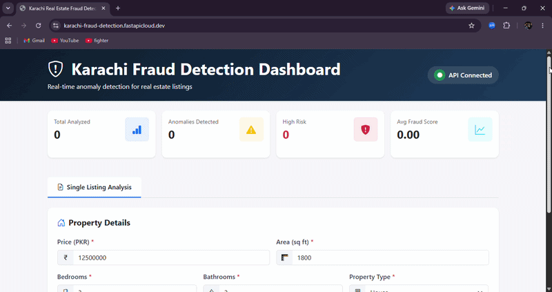
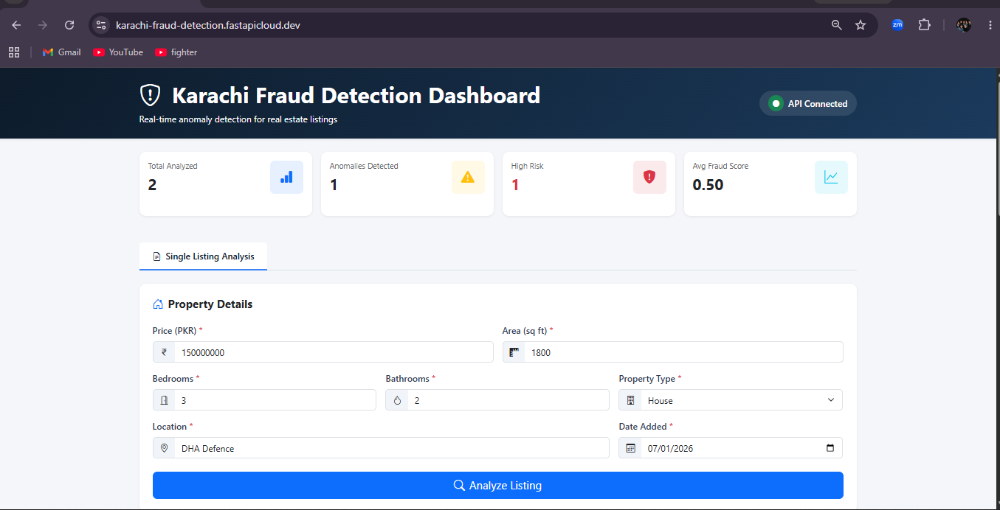
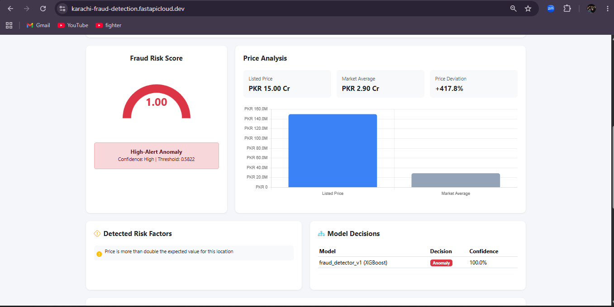
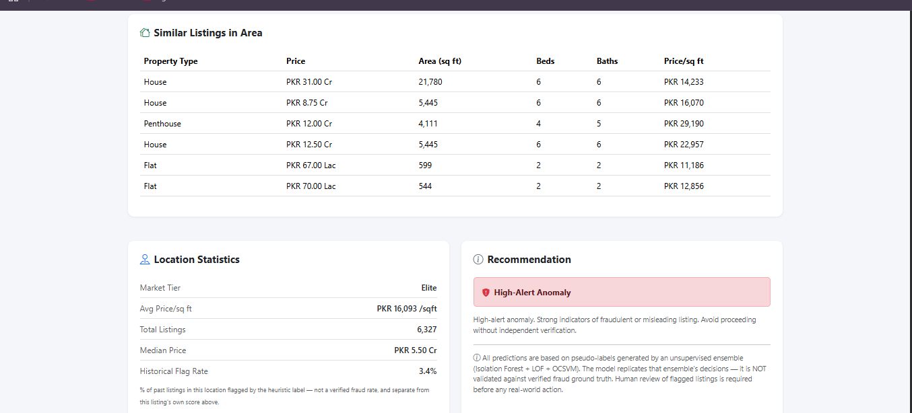

# Karachi Real Estate Anomaly Detection System

**An end-to-end ML pipeline for flagging statistically anomalous property listings in Karachi's real estate market — and an honest case study in why pseudo-label evaluation can mislead you.**


## Demo




| Property Details Form | High-Risk Result |
|---|---|
|  |  |

| Similar Listings & Recommendation |
|---|
|  |

**[Live Demo](https://karachi-fraud-detection.fastapicloud.dev)** ·

---

## Table of Contents

- [Problem Statement](#-problem-statement)
- [Business Objective](#-business-objective)
- [Honest Results Summary](honest-results-summary)
- [Dataset](#-dataset)
- [Project Architecture](#-project-architecture)
- [Features](#-features)
- [Technologies Used](#-technologies-used)
- [Installation](#-installation)
- [Project Structure](#-project-structure)
- [Methodology](#-methodology)
- [Model Training Pipeline](#-model-training-pipeline)
- [Evaluation Metrics & Results](#-evaluation-metrics--results)
- [Key Findings](#-key-findings)
- [Limitations](#-limitations)
- [Future Improvements](#-future-improvements)
- [How to Run the Project](#-how-to-run-the-project)
- [Deploying on FastAPI Cloud](#-deploying-on-fastapi-cloud)
- [Demo](#-demo)
- [License](#-license)
- [Author](#-author)

---

##  Problem Statement

Online real estate marketplaces like Zameen.com are vulnerable to listing-level manipulation: properties reposted dozens of times to dominate search rankings ("ghost listings"), prices deliberately set far outside local norms to lure clicks, and listings with corrupted or fabricated location data. None of these are *labelled* anywhere in the raw data — there is no `is_fraud` column, no human moderation log, no verified ground truth at all.

This project asks: **can a supervised model learn to flag these patterns using only signals derived from the listing data itself, with no verified fraud labels available?**

## Business Objective

For a property portal, manually reviewing all ~47,000 active listings is infeasible. The objective is to **prioritise a small subset of listings for human review** by surfacing the ones that deviate most from normal market behaviour — not to make autonomous fraud/no-fraud decisions. Precision-at-k (how many of the top-k flagged listings are worth a reviewer's time) matters more than overall accuracy.

---

##  Honest Results Summary

**Read this section before the metrics table below — it explains why the numbers are modest, and that explanation is the most valuable part of this project.**

This project went through two label-generation stages:

1. **Pseudo-labels** (weighted Isolation Forest + OCSVM anomaly score with percentile thresholding — LOF dropped from the ensemble per NB04 §14 due to a negative Spearman correlation with the heuristic label): used to *train* the supervised models.
2. **Heuristic labels** (`is_suspicious` — a hand-weighted rule combining several of the model's own input features: `price_loc_zscore`, `geo_anomaly`, `ghost_listing_flag`, `price_too_low_flag`, `price_very_high_flag`, `bath_bed_extreme`, `relisting_intensity`, `ppsqft_iqr_deviation`): used to *select* the final model and *optimise* its decision threshold, as a second, independent-ish signal.

The final selected model (**XGBoost**, chosen over LightGBM by a margin of 0.0016 PR-AUC during Optuna tuning — Random Forest was also compared and did not win) achieves:

| Metric | vs. Heuristic Label (test set) | vs. Pseudo-Label — training target (test set) |
|---|---|---|
| PR-AUC | **0.0716** | **0.981** |
| ROC-AUC | **0.385** | not computed |
| Base rate | 0.0957 | 0.0629 |

**What this means in plain terms:** against the label it was actually trained on (the pseudo-label), the model is essentially solved — PR-AUC of 0.981. Against the *independently constructed* heuristic label, PR-AUC drops to 0.0716 and ROC-AUC (0.385) is *below* 0.5, meaning the model ranks anomalies worse than random on that specific metric. That gap is the headline finding of this project, not a bug to hide.

**Why this happened, and why it's not a wasted project:** Section 6 of NB04 includes a direct feature-profile comparison between the unsupervised ensemble's top-scored anomalies and the heuristic-suspicious listings. It shows the two label sources measure genuinely different notions of "anomalous" — the ensemble (and the model trained on it) responds most strongly to **price deviation features**, while the heuristic label is dominated by **relisting/ghost-listing behaviour**. There's a second, subtler reason the heuristic-vs-model comparison is weaker evidence than it looks: `is_suspicious` is itself built from several of the same features the model consumes as input, so "PR-AUC vs heuristic" partly measures whether the model can reconstruct a hand-written rule from a subset of its own inputs — not agreement with independent, human-verified fraud outcomes. Both effects push in the same direction: the weak heuristic-vs-model numbers are a property of the *evaluation setup*, not proof the model learned nothing useful.

**What I would do differently:** Pick one label definition (the ensemble pseudo-label) for *both* training and final evaluation, rather than training on one and selecting/optimising the threshold on another that partially overlaps in features. See [Future Improvements](#-future-improvements).

This honesty is deliberate. A model card with strong-looking numbers that don't survive five minutes of scrutiny is a worse outcome in an interview than a modest, well-understood result with a clear post-mortem.

**A concrete consequence worth knowing for the interview:** the deployed model's decision threshold is **0.5822** (CV F1-optimised in NB06 §9), and the risk-level buckets (LOW/MEDIUM/HIGH/CRITICAL) in `api/predict.py` are computed relative to that threshold rather than fixed absolute cutoffs, so the tiering logic stays correct regardless of exactly where the threshold lands. Even so, a normal listing and a deliberately extreme 12×-overpriced test case can both surface elevated risk levels, because the model doesn't separate typical listings from outliers as cleanly as a healthy classifier would against the heuristic label. This is the same root cause surfacing a second time, in a different place — a useful thing to say out loud if asked "did you test the deployed API end-to-end."

---

##  Dataset

**Source**: Publicly scraped Zameen.com listings (Pakistan's largest property portal)
**Location**: Karachi, Pakistan
**Period**: August 2018 – July 2019
**Size**: 46,667 listings after filtering for Karachi, "For Sale" listings only

### Data Fields

| Field | Description | Example |
|---|---|---|
| `price` | Property price (PKR) | 12,500,000 |
| `area_sqft` | Area in square feet | 1,800 |
| `bedrooms` | Number of bedrooms | 3 |
| `baths` | Number of bathrooms | 2 |
| `property_type` | Property category | House, Flat, Upper Portion |
| `location` | Karachi locality | DHA Phase 6, Clifton |
| `latitude` / `longitude` | GPS coordinates | 24.8607, 67.0011 |
| `date_added` | Listing creation date | 2019-03-15 |

### Geographic Scope

Karachi bounding box used for geo-anomaly flagging: latitude `[24.74, 25.19]`, longitude `[66.68, 67.53]`. Listings outside these bounds are flagged as geographic anomalies (0.3% of the dataset — most likely data entry errors rather than fraud).

**Assumption noted:** these bounds and the price thresholds below (1M–500M PKR) are not externally sourced; they were chosen as reasonable cutoffs for the 2018–2019 Karachi market and are documented here as an explicit assumption rather than a verified standard.

---

##  Project Architecture

```
Raw Listings (46,667 rows)
        │
        ▼
┌──────────────────┐
│  NB01: Cleaning   │  Unit conversion, missing-value imputation, heuristic flags
└──────────────────┘
        │
        ▼
┌──────────────────┐
│   NB02: EDA       │  Distribution, geographic, and temporal analysis
└──────────────────┘
        │
        ▼
┌──────────────────┐
│ NB03: Features    │  47 engineered features, train/test split, scaling artifacts
└──────────────────┘
        │
        ▼
┌─────────────────────────────────┐
│ NB04: Unsupervised Ensemble      │
│  Isolation Forest + OCSVM        │
│  (weighted score, LOF dropped)   │
│  → percentile-threshold label    │
└─────────────────────────────────┘
        │
        ▼
┌─────────────────────────────────┐
│ NB05: Supervised Baselines       │
│  Random Forest, XGBoost, LightGBM│
└─────────────────────────────────┘
        │
        ▼
┌─────────────────────────────────┐
│ NB06: Tuning & Final Selection    │
│  Optuna (150 trials) per model    │
│  → fraud_detector_v1.pkl (XGBoost)│
└─────────────────────────────────┘
        │
        ▼
┌──────────────────┐
│  FastAPI Service  │  REST API + web UI, Dockerised, deployed to FastAPI Cloud
└──────────────────┘
```

---

##  Features

- **Two-stage pseudo-label pipeline**: unsupervised ensemble generates training labels; supervised models learn to generalise the pattern.
- **43 engineered features** spanning price deviation, location statistics, temporal patterns, and relisting behaviour (see [Methodology](#-methodology)).
- **Automated hyperparameter search** via Optuna (150 trials per candidate model, 5-fold stratified CV).
- **SHAP-based explainability**: global feature importance (bar, beeswarm) and individual-prediction explanations (waterfall, dependence plots).
- **Production REST API**: FastAPI service with single and batch prediction endpoints, human-readable risk factors per prediction, and a built-in caveat in every response.
- **Single-page web UI** for manual listing checks, with `/predict/batch` also available via the API for programmatic batch scoring (see `/docs`).
- **Dockerised local deployment** with a health check, plus a live FastAPI Cloud deployment.
- **Environment-aware notebooks**: auto-detect Google Colab vs. local execution rather than hard-failing outside Colab.

---

##  Technologies Used

| Category | Tools |
|---|---|
| Language | Python 3.11 |
| Data manipulation | pandas, NumPy |
| Modelling | scikit-learn, XGBoost, LightGBM |
| Hyperparameter tuning | Optuna (TPE sampler, median pruner) |
| Explainability | SHAP |
| Data validation | Pandera |
| Visualization | Matplotlib, Seaborn |
| API | FastAPI, Pydantic, Uvicorn |
| Deployment | Docker, Docker Compose, FastAPI Cloud |
| Notebooks | Jupyter / Google Colab |

---

##  Installation

### Prerequisites
- Python 3.11
- pip or conda
- Docker (optional, for containerised deployment)

### Option A — API only (fastest)

```bash
git clone https://github.com/areebaarshadqureshi/Projects
cd karachi_fraud_detection
pip install -r requirements-api.txt
```

### Option B — Full environment (notebooks + API)

```bash
git clone https://github.com/areebaarshadqureshi/Projects
cd karachi_fraud_detection
pip install -r requirements.txt
```

> **Note on large files:** `data/` and the training-only contents of `models/` are excluded from version control (raw data + training arrays total ~280MB, well over what's needed at runtime). The files the API actually needs — `fraud_detector_v1.pkl` plus the preprocessing artifacts in `models/artifacts/` — total ~1MB and **are** committed to this repo, so a fresh clone runs the API immediately with no download step. If you're regenerating everything from scratch, run notebooks 01→06 in order, or see `scripts/download_artifacts.sh` for where to obtain `raw_listings.csv`.

---

## Project Structure

```
karachi_fraud_detection/
├── notebooks/                          # Jupyter pipeline (run 01 → 06 in order)
│   ├── 01-data_cleaning.ipynb
│   ├── 02-eda.ipynb
│   ├── 03-feature_engineering.ipynb
│   ├── 04-unsupervised_model.ipynb
│   ├── 05-supervised_models.ipynb
│   └── 06-model_comparison_and_hyperparameter_tuning.ipynb
│
├── api/                                 # FastAPI application
│   ├── main.py                          # Routes, lifespan startup, CORS
│   ├── predict.py                       # FraudDetector inference class
│   └── schemas.py                       # Pydantic request/response models
│
├── src/                                 # Reusable source modules
│   └── features/
│       └── feature_engineer.py          # Production feature engineering (mirrors NB03)
│
├── config/
│   └── config.py                        # Paths and constants
│
├── static/
│   └── index.html                       # Single-page web UI
│
├── scripts/
│   └── download_artifacts.sh            # Fetches large training-only files (data/, extra models)
│
├── models/
│   ├── fraud_detector_v1.pkl            # Final XGBoost model — committed, required at runtime
│   └── artifacts/                       # Preprocessing artifacts — committed, required at runtime
│       ├── scaler_robust_v1.pkl
│       ├── loc_freq_map.pkl
│       ├── market_tier_map.pkl
│       ├── ohe_encoder.pkl
│       ├── clip_limits.pkl
│       ├── zscore_stats_train.pkl
│       ├── volume_stats_train.pkl
│       ├── model_feature_cols.pkl
│       ├── fraud_detector_v1_metadata.pkl
│       └── fraud_detector_v1_threshold.pkl
│   # Candidate models (isolation_forest.pkl, random_forest_v1.pkl, lightgbm_v1.pkl,
│   # ocsvm_clean.pkl) are kept locally to support the model-comparison notebooks
│   # but are not committed or shipped in the API image — only fraud_detector_v1.pkl
│   # is loaded at inference time.
│
├── data/                                 # Not committed — see Installation
│   ├── raw/raw_listings.csv
│   └── preprocessed/
│       ├── all_listings_with_flags.csv
│       ├── feature_engineered.csv
│       ├── model_scored_listings.csv
│       └── suspicious_listings.csv
│
├── reports/figures/                      # All EDA, SHAP, and evaluation plots
├── tests/
│   └── test_api.py                       # Pytest suite for the API
│
├── Dockerfile
├── docker-compose.yml
├── Makefile
├── requirements.txt                      # Full environment (training + API)
├── requirements-api.txt                  # Inference-only dependencies
├── .env.example
└── README.md
```

---

##  Methodology

### Feature Engineering (43 features feeding the final model)

| Group | Examples |
|---|---|
| Basic | `price`, `area_sqft`, `bedrooms`, `baths`, `price_per_sqft` |
| Ratios | `bath_bed_ratio`, `area_per_bedroom`, `price_vs_expected_ratio` |
| Location z-scores | `price_loc_zscore`, `area_sqft_loc_zscore`, `price_per_sqft_loc_zscore` |
| IQR deviation | `price_iqr_deviation`, `ppsqft_iqr_deviation`, `area_iqr_deviation` |
| Temporal | `listing_month`, `listing_quarter`, `listing_dow`, `is_weekend`, `weekly_volume_ratio` |
| Relisting / ghost behaviour | `relisting_count`, `relisting_intensity`, `is_multi_relisted` |
| Heuristic flags | `bath_bed_extreme`, `high_cv_location`, `price_below_50pct_expected`, `price_above_200pct_expected` |
| Encodings | `location_enc` (frequency encoding), one-hot `property_type_*`, `market_tier_derived_*` |

All location-based statistics (means, medians, IQRs) are computed from the **training split only** and applied to the test split via lookup, avoiding train/test leakage for these features.

### Why pseudo-labels at all?

No verified fraud ground truth exists in this dataset. The project uses a weighted combination of two unsupervised anomaly detectors (Isolation Forest + OCSVM, with a percentile threshold) as a *proxy* label — LOF was dropped from this ensemble after NB04 §14 found it had a negative Spearman correlation with the heuristic label — and treats that proxy itself as a hypothesis to be evaluated, not a ground truth. See [Honest Results Summary](honest-results-summary) for what that evaluation actually found.

---

## Model Training Pipeline

1. **Data Cleaning (NB01)** — filter to Karachi "For Sale" listings, convert Marla/Kanal to sqft, impute missing bedroom/bath counts by location median, flag ghost listings (≥5 relistings within 30 days) and geo/price anomalies.
2. **EDA (NB02)** — distribution analysis, geographic heatmaps, temporal patterns, anomaly-flag overlap.
3. **Feature Engineering (NB03)** — compute all 47 raw engineered features, stratified 80/20 train/test split, fit RobustScaler and StandardScaler on train only, persist all preprocessing artifacts.
4. **Unsupervised Ensemble (NB04)** — train Isolation Forest, LOF, and One-Class SVM independently; LOF is then dropped from the ensemble (§14) after a feature-profile comparison found it negatively correlated with the heuristic label, and a weighted Isolation Forest + OCSVM continuous score with percentile thresholding produces the pseudo-label used from NB05 onward (6.29% positive rate on the full dataset).
5. **Supervised Baselines (NB05)** — train Random Forest, XGBoost, and LightGBM on the pseudo-label with `scale_pos_weight` for class imbalance; 5-fold stratified cross-validation.
6. **Tuning & Selection (NB06)** — Optuna search (150 trials per model, TPE sampler, median pruner) optimising PR-AUC against the **heuristic** label via cross-validation; XGBoost selected over LightGBM by a 0.0016 PR-AUC margin; threshold optimised via 5-fold CV on the training set only (landing at 0.5822), then evaluated once on the held-out test set.

---

## Evaluation Metrics & Results

**Final model: XGBoost** (`n_estimators=385, max_depth=6, learning_rate=0.136, subsample=0.72, colsample_bytree=0.77`)
**Decision threshold:** 0.5822 (optimised via cross-validation, never touched the test set during search)

| Metric | vs. Heuristic Label (test set) | vs. Pseudo-Label (test set) |
|---|---|---|
| PR-AUC | 0.0716 | 0.981 |
| ROC-AUC | 0.385 | — |
| Base rate | 0.0957 | 0.0629 |

See [Honest Results Summary](honest-results-summary) above for what these numbers mean and why they diverge so sharply between the two label sources. The underlying diagnostic plots are in `reports/figures/`:
- `_label_comparison.png` — heuristic vs. pseudo-label anomaly rate and agreement confusion matrix
- `_baseline_comparison.png`, `_cv_comparison.png` — XGBoost vs. Random Forest vs. LightGBM across CV folds
- `_threshold_analysis_best_model.png` — precision/recall trade-off across thresholds
- `_shap_bar.png`, `_shap_beeswarm.png`, `_shap_waterfall.png`, `_shap_dependence.png` — feature attribution for the final model

### Top Features by SHAP Importance

The SHAP analysis (see `reports/figures/_shap_bar.png`) consistently surfaces price-deviation features (`price_iqr_deviation`, `price_loc_zscore`, `price_per_sqft`) as the dominant signal, with relisting-based features (`relisting_intensity`) contributing less than in the heuristic label definition — which is itself a root cause of the metric mismatch discussed above.

---

## Key Findings

1. **The two label sources disagree on what "anomalous" means.** The unsupervised ensemble is price-deviation-driven; the heuristic label is relisting-driven. This single fact, combined with partial feature overlap between the heuristic label and the model's inputs, explains most of the modest cross-label metrics and is the most important takeaway from the project.
2. **Ghost listings are prevalent in the raw data.** 23.3% of listings have 10+ relistings, with some properties reposted 200+ times — a strong, easily-verified signal independent of any model.
3. **Geographic anomalies are rare** (0.3% of listings outside Karachi's bounding box), most plausibly explained by data entry error rather than intentional manipulation.
4. **Market tier materially changes what "normal" pricing looks like.** Elite-tier locations (DHA, Clifton, Bahria Town) have a median price/sqft roughly double that of Affordable-tier locations (Korangi, Orangi) — meaning any anomaly detector needs location-relative, not absolute, price features. This project's z-score and IQR-deviation features already account for this.
5. **A model is only as good as the agreement between its training and evaluation labels — and the independence of those labels matters as much as their agreement.** This is a generalisable lesson for any future pseudo-labelling project, not specific to real estate.

---

## Limitations

### Critical
- **No verified ground truth.** Every metric in this project measures agreement between two machine-generated label sources, not real-world fraud detection accuracy.
- **The training and evaluation labels are not the same signal, and partially overlap in features**, as detailed above — this is the primary reason the cross-label metrics are weak, and is the most important thing to disclose before any real-world use.
- **Soft temporal leakage**: `listings_per_week_in_area` is computed on the full dataset before the train/test split in NB01. The test set's own presence marginally inflates its own weekly count. The effect is minor (the week genuinely had that volume regardless of which split a row landed in) but is a leakage path that should be fixed by computing this feature from train-only data in any rework.

### Technical
- **Karachi-specific hardcoding**: geographic bounds, price thresholds, and area-unit conversions are tuned to this dataset and period; not transferable to another city without re-deriving them.
- **Temporal drift**: prices and listing patterns have moved substantially since 2018–2019; a production system needs retraining on current data.
- **Single-inference feature gaps**: `weekly_volume_ratio` defaults to 1.0 and `listings_per_week_in_area` to 0 for single predictions, since these need batch context to compute properly. Batch predictions compute them from the batch itself.
- **No seller, text, or image features.** Listing descriptions, seller history, and photo quality are not used at all — these are likely a richer signal than tabular features alone (see Future Improvements).

---

## Future Improvements

### Immediate (highest priority given the Honest Results Summary)
1. **Unify the label definition.** Train and evaluate against the *same* label — either drop the heuristic label entirely and use only the ensemble pseudo-label end-to-end, or fold the heuristic rules directly into the ensemble vote so there is one consistent target throughout, with no feature overlap with the evaluation label.
2. **Fix the soft temporal leakage** in `listings_per_week_in_area` by computing it from train-only data and mapping to test, the same way the location statistics already are.
3. **Calibrate the model's probability outputs** (e.g. `CalibratedClassifierCV`) before presenting risk levels as if they were calibrated probabilities to end users.

### Medium-term
4. **NLP on listing descriptions** — scam keyword detection, urgency-language scoring.
5. **Seller-level features** — account age, listing history, response patterns (would require data not present in this scrape).
6. **Disaggregated bias audit** — check whether anomaly rates differ systematically by property type or market tier in ways driven by feature artefacts rather than genuine signal.

### Long-term
7. **Active learning loop** with real human-reviewer feedback to build an actual ground-truth label set over time.
8. **Multi-city extension** to Lahore and Islamabad with city-specific recalibration of price thresholds and geographic bounds.

---

## How to Run the Project

This repo includes a `Makefile` that wraps every command below — run `make help` at any time to see the full list of shortcuts.

### Fastest path: run the API (uses the already-trained, committed model)

```bash
make install-api
make api
# or without make:
pip install -r requirements-api.txt
uvicorn api.main:app --reload
# Visit http://localhost:8000/docs for interactive API docs
```

### Retrain everything from scratch

```bash
make install
make pipeline        # runs notebooks 01 → 06 non-interactively via nbconvert
```

The notebooks are still the primary record of the analysis — the EDA, the NB04 §14 LOF-drop decision, the SHAP audit — so for following the reasoning step by step, open them individually instead:

```bash
make notebook         # or: jupyter notebook
# Run in order: 01 → 02 → 03 → 04 → 05 → 06
```

Notebooks auto-detect whether they're running in Google Colab or locally and adjust the project root accordingly.

### Run with Docker

```bash
make docker-up
# or: docker-compose up --build
# Frontend:   http://localhost:8000
# API docs:   http://localhost:8000/docs
# Health:     http://localhost:8000/health
```

### Run the test suite

```bash
# Start the API first (see above), then in another terminal:
make test-api
# or: pytest tests/test_api.py -v
```

### Example API request

```bash
curl -X POST http://localhost:8000/predict \
  -H "Content-Type: application/json" \
  -d '{
    "price": 12500000,
    "area_sqft": 1800,
    "bedrooms": 3,
    "baths": 2,
    "property_type": "House",
    "location": "DHA Phase 6",
    "date_added": "2024-01-15"
  }'
```

---

## Deploying on FastAPI Cloud

Since the API only needs `models/fraud_detector_v1.pkl` (~930KB) and ~10 small artifact files (~150KB combined), the whole deployable footprint is under 2MB — no external download step or large-file hosting is needed.

1. Install the CLI (bundled with FastAPI's `standard` extra):
   ```bash
   pip install "fastapi[standard]"
   ```
2. A root-level `main.py` re-exports the app so the CLI can auto-detect it:
   ```python
   from api.main import app
   ```
3. Authenticate (opens a browser device-login flow, no card required on the free Hobby plan):
   ```bash
   fastapi login
   ```
4. Deploy from the project root:
   ```bash
   fastapi deploy
   ```
5. FastAPI Cloud installs from `requirements.txt`, builds, and returns a live URL like `https:///karachi-fraud-detection.fastapicloud.dev`.
6. Confirm the deployment: visit `/docs` for the interactive Swagger UI, then `/health` to confirm the model and artifacts loaded correctly.

A `.fastapicloudignore` file excludes `data/`, `notebooks/`, `reports/`, and the unused candidate models (`lof.pkl`, `random_forest_v1.pkl`, etc.) from the upload, so only the files `api/predict.py` actually loads at runtime get shipped.

### Alternative: Docker

`Dockerfile` and `docker-compose.yml` are kept in this repo for self-hosted Docker deployment, as an alternative if you'd rather use a platform that requires card verification, or want to self-host.

---

## Author

**Areeba Arshad**
Fresh Computer Science graduate, FAST University Karachi
Background: CampusX Data Science Mentorship Program

- GitHub: [https://github.com/areebaarshadqureshi](https://github.com/areebaarshadqureshi)

---

**Built with**: Python • scikit-learn • XGBoost • LightGBM • Optuna • SHAP • FastAPI • Docker • FastAPI Cloud

**Trained on**: 46,667 Karachi real estate listings (Aug 2018 – Jul 2019)

**Status**: Portfolio project — not validated for real-world fraud detection (see [Honest Results Summary](honest-results-summary) and [Limitations](#-limitations))
