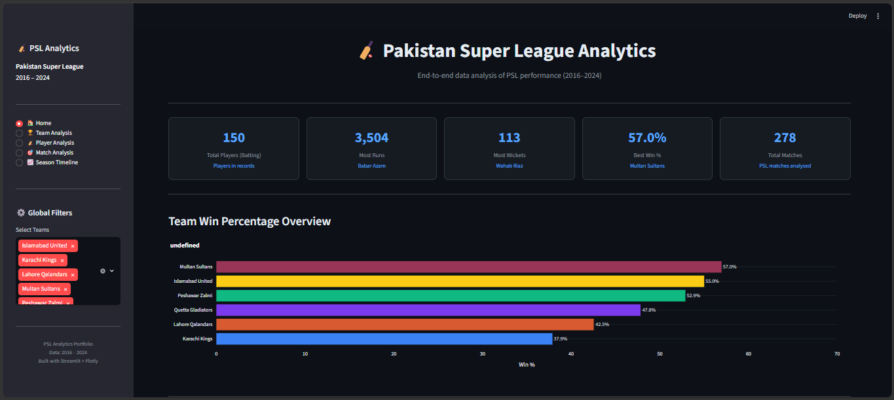
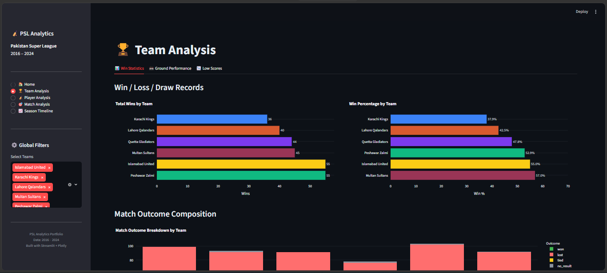
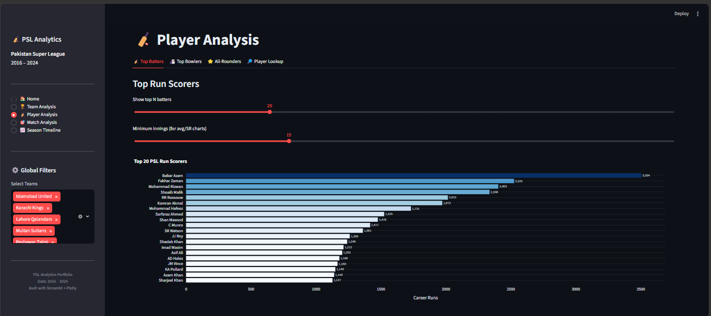
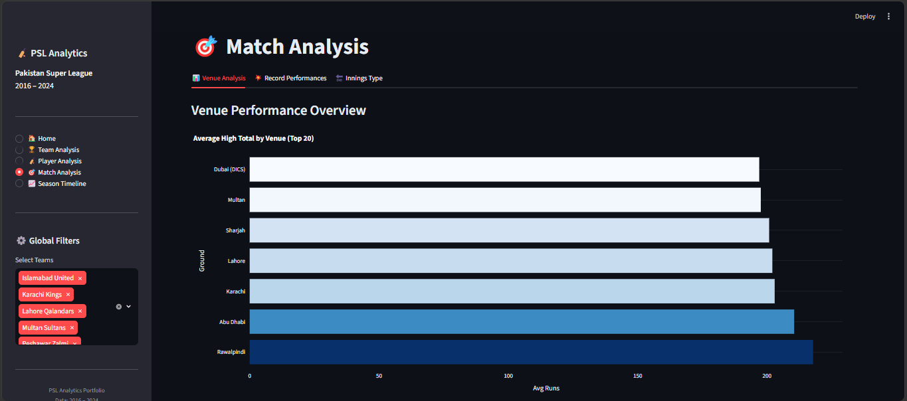
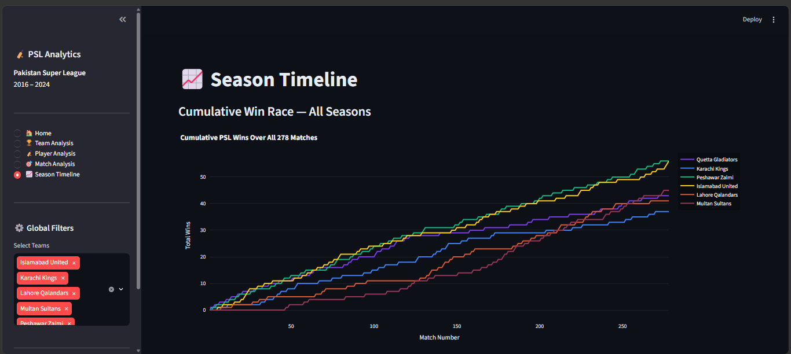

# 🏏 PSL Data Analytics Project (2016–2024)

End-to-end exploratory data analysis of Pakistan Super League performance data,
structured as a 5-notebook pipeline with both CSV and Excel deliverables, plus an
interactive Streamlit dashboard.


---

## Streamlit Dashboard Preview

The dashboard is organized into five pages, each covering a different angle of PSL performance analysis.

| Home | Team Analysis |
|---|---|
|  |  |

| Player Analysis | Match Analysis |
|---|---|
|  |  |

| Season Timeline |
|---|
|  |

---

## Project Structure

```
PSL_Project/
│
├── data/
│   ├── raw/                  ← Original 12 CSVs (never modify these)
│   └── preprocessed/         ← Cleaned & feature-enriched CSVs + Excel workbooks
│       ├── *_clean.csv                  (output of NB01)
│       ├── psl_cleaned_data.xlsx        (output of NB01 — multi-sheet workbook)
│       ├── *_feat.csv                   (output of NB03)
│       ├── psl_feature_engineered.xlsx  (output of NB03)
│       └── PSL_Business_Report.xlsx     (output of NB05 — formatted dashboard)
│
├── notebooks/
│   ├── 01_data_cleaning.ipynb
│   ├── 02_initial_eda.ipynb
│   ├── 03_feature_engineering.ipynb
│   ├── 04_final_eda.ipynb
│   └── 05_excel_business_report.ipynb
│
├── app/
│   └── app.py              ← Streamlit dashboard (4 pages)
│
├── charts/                 ← Exported chart images (optional)
├── assets/
│   ├── screenshots/         ← Dashboard page screenshots (used in this README)
│
├── requirements.txt
├── README.md
└── .gitignore
```

---

## Datasets (`data/raw/`)

| File | Category | Description |
|------|----------|-------------|
| `most_runs_by_player.csv` | Batting | Career run totals for all PSL batters |
| `highest_individual_score.csv` | Batting | Highest scores in a single innings |
| `most_sixes_in_innings.csv` | Batting | Most sixes hit in a single innings |
| `most_sixes_psl_history.csv` | Batting | All-time six-hitting leaders |
| `most_wickets_psl.csv` | Bowling | Career wicket totals for all PSL bowlers |
| `best_bowling_figures.csv` | Bowling | Best bowling figures in a single innings |
| `most_catches_psl.csv` | Fielding | All-time catch leaders |
| `most_dismissals_wk.csv` | Fielding | Wicket-keeper dismissal records |
| `highest_totals.csv` | Team | Highest team totals in PSL history |
| `lowest_totals.csv` | Team | Lowest team totals in PSL history |
| `result_summary_teams.csv` | Team | Overall win/loss record per team |
| `cumulative_match_wins.csv` | Timeline | Cumulative wins per team over 278 matches |

**Known data quirks handled in NB01:** `*` suffix on not-out scores, `-` used as a
zero/null placeholder across several columns (NO, Mdns, century/fifty counts, 4s/6s,
wicket-keeper dismissals), `Span` as a `"2016-2024"` string, `Score` as a `"262/3"`
string, `BBI` as a `"4/17"` string.

---

## Notebook Guide

### NB01 — Data Cleaning
**Goal:** Fix all data quality issues. Save clean files to `data/preprocessed/` as
both individual CSVs and one combined Excel workbook (`psl_cleaned_data.xlsx`,
one sheet per dataset).

What it covers:
- Load all 12 raw CSVs, check shape/dtypes/nulls/duplicates
- Fix `*` not-out markers, `-` placeholders, `Span`/`Score`/`BBI` string parsing
- Standardise column names, parse `Match Date` into datetime
- Consistency checks, then export to CSV + formatted Excel workbook

### NB02 — Initial EDA
**Goal:** Understand the raw data before engineering features — statistical
summaries, distributions, correlation heatmaps, missing-value checks.

### NB03 — Feature Engineering
**Goal:** Create new columns with analytical value, e.g. `bat_efficiency_score`,
`bowl_impact_score`, `win_pct_effective`, `era` (Early/Mid/Modern PSL). Saves
enriched CSVs plus a second Excel workbook (`psl_feature_engineered.xlsx`).

### NB04 — Final EDA & Business Insights
**Goal:** Full storytelling through data — univariate, bivariate, and
multivariate analysis, ending with concrete business insights (e.g. Karachi
Kings performance diagnosis, venue dominance, batting-first vs chasing).

### NB05 — Excel Business Report
**Goal:** Go beyond `df.to_excel()` and build a stakeholder-ready dashboard
workbook (`PSL_Business_Report.xlsx`) with:
- A **Dashboard** sheet with KPI cards driven by **live Excel formulas**
  (`INDEX/MATCH`, `MAX`, `COUNTA`) — not hardcoded numbers
- Ranked batting/bowling leaderboards with conditional formatting (color scales)
- Team standings with live `Win % = Won/Matches*100` formulas and an embedded
  bar chart
- A season timeline sheet with an embedded line chart

---

## Streamlit Dashboard

The dashboard (`app/app.py`) presents the analysis interactively across five pages, with global team filters available throughout:

1. **Home** — league-wide overview and summary stats
2. **Team Analysis** — team-level performance, standings, and win comparisons
3. **Player Analysis** — batting and bowling leaderboards, player efficiency scores
4. **Match Analysis** — match-level breakdowns and results
5. **Season Timeline** — cumulative wins over time and lead-gap tracking between top teams

### Running it locally

```bash
pip install -r requirements.txt
streamlit run app/app.py
```

---

## Setup in Google Colab

```python
from google.colab import drive
drive.mount('/content/drive')

!pip install -r /content/drive/MyDrive/PSL_Project/requirements.txt
```

Set `RAW = '/content/drive/MyDrive/PSL_Project/data/raw/'` in NB01.

---

## Methodology

The project follows a structured, end-to-end analytics workflow:

1. **Data Collection** — 12 raw CSVs covering batting, bowling, fielding, and team-level PSL statistics (2016–2024), sourced as separate category-specific files.
2. **Data Cleaning** — standardised inconsistent formats (not-out markers, placeholder values, string-encoded scores and figures), handled nulls and duplicates, and parsed dates into proper datetime objects (NB01).
3. **Exploratory Data Analysis** — examined distributions, correlations, and missing-value patterns to understand the raw data before transforming it (NB02).
4. **Feature Engineering** — derived analytical metrics not present in the raw data, such as batting efficiency scores, bowling impact scores, and effective win percentages, to support deeper comparisons (NB03).
5. **Insight Generation** — conducted univariate, bivariate, and multivariate analysis to surface concrete, decision-relevant findings, including a focused diagnostic on Karachi Kings' performance (NB04).
6. **Reporting & Delivery** — translated findings into two deliverable formats: a formula-driven Excel business report for stakeholders who prefer spreadsheets (NB05), and an interactive Streamlit dashboard for real-time exploration across teams, players, matches, and seasons.

Each stage's output feeds directly into the next, with cleaned and engineered datasets saved at every step to keep the pipeline reproducible.

---

## Problem Statement

Analysing PSL performance from 2016–2024 to identify what factors make teams win
(venue advantage, batting first vs chasing, player profiles) and specifically
what Karachi Kings need to improve to compete at the top.

---

## Tech Stack

Python · Pandas · NumPy · Matplotlib/Seaborn · Plotly · Streamlit · OpenPyXL

---

## Author

**Areeba Arshad**
Computer Science Graduate — FAST-NUCES
GitHub: [@areebaarshadqureshi](https://github.com/areebaarshadqureshi)
