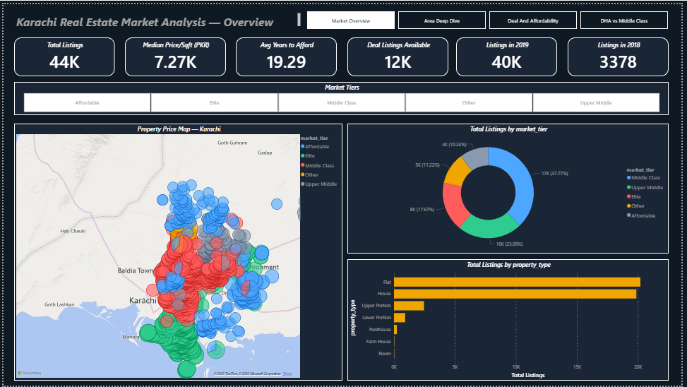

# Karachi Real Estate Market Analysis
### Historical Snapshot (2018–2019) & Affordability Timeline (2019–2026)

---

<p align="center">
  
</p>

## Project at a Glance

| Metric | Value |
|---|---|
| Total listings analysed | 44,392 |
| Raw dataset size (Karachi, For Sale) | 46,482 |
| Date range | August 2018 – July 2019 |
| Reliable areas covered | 17 (≥200 listings threshold) |
| Median property price (2019) | PKR 12,500,000 |
| Median affordability (2019 salary PKR 22K/month) | **47.3 years** |
| Median affordability (2026 est. PKR 43K/month) | **58.9 years** |
| Affordability change (2019→2026) | **+11.6 years worse** |
| CPI multiplier 2019→2026 | **2.431× (143.1% cumulative)** |
| Below-median deal opportunities (reliable areas) | 11,610 listings |

---

## Problem Statement

Karachi's real estate market has undergone major structural changes between 2019 and today. Using 44,392 property listings from Zameen.com (August 2018 – July 2019) as a historical baseline, this project analyses price patterns across 17 areas and market tiers, then applies Pakistan's CPI and wage growth data to estimate how housing affordability has shifted over seven years of inflation.

**Three questions this project answers:**

1. **What did Karachi's housing market look like in 2019?** — price patterns, area tiers, property type distributions.
2. **Which areas and property types were accessible to salaried buyers in 2019?** — affordability index using the historically correct 2019 Karachi median salary of PKR 22,000/month (PBS PSLM FY2019).
3. **How has inflation changed the affordability gap by 2026?** — CPI multiplier 2.431× applied to 2019 prices, evaluated against the 2026 estimated salary of PKR 43,000/month.

---

## Dataset Details

| Attribute | Detail |
|---|---|
| Source | Zameen.com (Pakistan's largest property portal) |
| Raw scope | 168,446 listings across all Pakistan |
| After filtering | Karachi, For Sale: 46,482 rows |
| After cleaning | 46,323 rows (bedrooms >10, baths >10, price <500K removed) |
| After outlier removal | **44,392 rows** (1st–99th percentile on price, area, ppsqft) |
| Columns (raw) | property_type, location, price, area (various units), bedrooms, baths, date_added, latitude, longitude |
| External data | Pakistan CPI (PBS/SBP), wage data (PBS PSLM / LFS) — see `data/external/` |

**Salary benchmarks used (period-appropriate):**

| Year | Salary | Source |
|---|---|---|
| 2019 | PKR 22,000/month | PBS PSLM FY2019 urban Karachi median (actual) |
| 2026 | PKR 43,000/month | PBS LFS FY2024-25 official (PKR 39,042) + 10% YoY estimate |

**CPI reference (2019 = 100 index base):**

| Year | CPI Index | Cumulative Inflation |
|---|---|---|
| 2019 | 100.0 | Baseline |
| 2020 | 110.7 | +10.7% |
| 2021 | 120.6 | +20.6% |
| 2022 | 135.3 | +35.3% |
| 2023 | 174.8 | +74.8% |
| 2024 | 215.7 | +115.7% |
| 2025 | 226.3 | +126.3% (PBS actual) |
| 2026 | 243.1 | +143.1% (PBS April 2026 actual + 2-month estimate) |

> **Methodology note:** The CPI multiplier used throughout this project is **2.431×** (CPI 243.1 ÷ 100). This reflects the PBS-reported price index, not an estimate. Earlier versions of this project used an estimated CPI of 355 (multiplier 3.55×) — this has been corrected to reflect actual PBS data.

---

## Workflow

```
Raw CSV (168K rows)
      │
      ▼ Filter to Karachi + For Sale
01-data_cleaning.ipynb
      │  ├─ Remove invalid bedrooms/baths (>10)
      │  ├─ Remove price <500K, area=0
      │  ├─ Standardise area units → sqft
      │  └─ Impute missing baths (bedroom-group median)
      │
      ▼
02-feature_engineering.ipynb
      │  ├─ Outlier removal (1st–99th percentile)
      │  ├─ price_per_sqft, price_per_marla
      │  ├─ affordability_years (2019 base, PKR 22K/month)
      │  ├─ estimated_price_2026 (× 2.431 CPI multiplier)
      │  ├─ affordability_years_2026 (PKR 43K/month)
      │  ├─ affordability_change (2026 − 2019)
      │  ├─ market_tier (Elite/Upper Middle/Middle/Affordable)
      │  └─ month_year (temporal grouping)
      │
      ▼
03-eda.ipynb
      │  ├─ SQL: reliable areas view (≥200 listings)
      │  ├─ SQL: deal finder view (pct_vs_median)
      │  ├─ Univariate analysis (6 numeric distributions)
      │  ├─ Bivariate analysis (area vs price, bedroom premium)
      │  ├─ Multivariate (heatmap, 3D scatter, tier comparison)
      │  ├─ Affordability timeline 2019–2026
      │  └─ Folium interactive price map
      │
      ▼
04-statistics_and_results.ipynb
         ├─ Mann-Whitney U: DHA vs Gulshan price/sqft
         ├─ Spearman correlation: size vs price
         └─ Final project summary + recommendations
```

---

## Tech Stack

| Tool | Purpose |
|---|---|
| Python 3.11 | Core analysis language |
| Pandas, NumPy | Data cleaning, feature engineering, aggregations |
| Matplotlib, Seaborn | Static and analytical visualisations |
| Plotly | Interactive charts and 3D scatter |
| Folium | Interactive Karachi price map (area-level centroids) |
| MySQL + SQLAlchemy | Window function queries, SQL views, database export |
| SciPy | Hypothesis testing (Mann-Whitney U, Spearman correlation) |
| Power BI | Interactive 5-page business dashboard |

---

## EDA Process

The EDA is structured in four layers:

**Layer 1 — Univariate analysis** examines the distribution of each numeric feature individually (price, area_sqft, price_per_sqft, bedrooms, baths, affordability_years). All major features are confirmed right-skewed, validating the use of median (not mean) as the central measure throughout the project.

**Layer 2 — Bivariate analysis** investigates relationships between variable pairs: property type vs price per sqft, number of listings per area, median price per sqft by area, bedroom count vs median price broken down by top-5 areas, and property size vs price scatter.

**Layer 3 — Multivariate analysis** uses correlation heatmaps, 3D scatter (area × price_per_sqft × affordability), and a three-panel DHA vs Middle Class comparison (price per sqft, affordability years, median area sqft).

**Layer 4 — Affordability timeline** applies the CPI multiplier and wage data to build the 2019→2026 comparison across all 17 reliable areas and all four market tiers.

---

## Feature Engineering

| Feature | Formula / Method | Business Purpose |
|---|---|---|
| `price_per_sqft` | price ÷ area_sqft | Normalises by size; enables fair area comparison |
| `price_per_marla` | price ÷ (area_sqft ÷ 272.25) | Local unit conversion for Pakistani context |
| `affordability_years` | price ÷ (22,000 × 12) | Years of 2019 gross salary to purchase |
| `estimated_price_2026` | price × 2.431 | CPI-adjusted price estimate for 2026 |
| `affordability_years_2026` | estimated_price_2026 ÷ (43,000 × 12) | Years of 2026 gross salary to purchase |
| `affordability_change` | afford_2026 − afford_2019 | Direction and magnitude of affordability shift |
| `market_tier` | Area-based mapping | Groups areas into Elite / Upper Middle / Middle / Affordable |
| `month_year` | Extracted from date_added | Temporal grouping for listing volume trends |

---

## Power BI Dashboard

Five pages, each targeting a specific audience:

| Page | Audience | Key Visuals |
|---|---|---|
| **Market Overview** | General reader | KPI cards (CPI 2.431×), Karachi price map, tier donut, property type distribution |
| **Area Deep Dive** | Investor | Price per sqft by area (sorted), bedroom premium line chart, area metrics table |
| **Affordability & Deals** | Salaried buyer / Deal hunter | Dual affordability index (2019: 47.3 yrs vs 2026: 58.9 yrs), deal finder chart |
| **DHA vs Middle Class** | Tier comparison | Head-to-head metrics: DHA vs Gulshan, full tier comparison table |
| **2019 vs 2026 Comparison** | Investor / Policy maker | CPI vs salary divergence, area-level heatmap, purchasing power erosion |

**Key KPI cards (corrected):**
- 2019 Affordability: 47.3 years (PKR 22,000/month)
- 2026 Est. Affordability: 58.9 years (PKR 43,000/month)
- Affordability change: +11.6 years worsened
- CPI multiplier: 2.431× (143.1% cumulative)
- Salary growth: +95.5% (PKR 22K → PKR 43K)

---

## Key Findings

### 1 — Location premium is extreme (3.3×)
DHA Defence commands **PKR 14,692/sqft** vs Liaquatabad at **PKR 4,489/sqft** — a 3.3× gap for comparable property sizes. This reflects infrastructure, security, gated-community status, and investor sentiment rather than physical property differences.

### 2 — Location beats bedrooms
Adding a bedroom increases price significantly in DHA and Clifton but the premium flattens after 4 bedrooms in middle-class areas. A 5-bedroom house in North Nazimabad can cost less than a 3-bedroom flat in DHA.

### 3 — Housing was already in crisis in 2019
Using the correct 2019 urban Karachi median salary of **PKR 22,000/month** (PBS PSLM FY2019), the median Karachi property required **47.3 years** of gross salary to purchase. Elite areas (DHA, Clifton) required over 100 years — completely inaccessible to any salaried buyer.

### 4 — Inflation worsened affordability further by 2026
Pakistan's CPI rose **143.1%** from 2019 to 2026 (a **2.431× multiplier**), while average Karachi salaries grew only **~95.5% nominally** (PKR 22,000 → PKR 43,000/month). Because property inflation (2.431×) exceeded salary growth (1.955×), real housing purchasing power fell to 80.4% of its 2019 level. The median property now requires an estimated **58.9 years** of the 2026 salary — **11.6 years worse** than 2019.

> **Note on previous version:** An earlier version incorrectly stated the 2026 salary as PKR 70,000/month and the CPI multiplier as ~3.55×. These were based on an older trajectory estimate. This version uses the PBS April 2026 actual CPI (243.1 on 2019=100 base) and PBS LFS 2024-25 official salary data.

### 5 — Best value areas for salaried buyers
Federal B Area and Gulshan-e-Iqbal showed the smallest affordability deterioration 2019→2026. Bahria Town Karachi offers Elite-comparable property sizes at roughly 40% of DHA's price per sqft — the strongest mid-market value proposition.

### 6 — 11,610 below-median deal opportunities
Across the 17 reliable areas, **11,610 listings** are priced more than 20% below their area median price per sqft — including 2,100+ in DHA alone. Data-driven buyers can find negotiable entry points even in premium areas.

---

## Statistical Methodology

| Decision | Rationale |
|---|---|
| **Reliable areas threshold: ≥200 listings** | Below 200, statistical aggregates (median, IQR) are unstable |
| **Outlier removal: 1st–99th percentile** | Removes data-entry errors; preserves genuine luxury and low-end properties |
| **Mann-Whitney U (not t-test)** | Price/sqft is right-skewed — non-parametric test required |
| **Spearman (not Pearson)** | Size–price relationship is monotonic but non-linear |
| **Affordability formula: Price ÷ (Monthly Salary × 12)** | Standard years-of-gross-income index for cross-market comparison |
| **2019 salary: PKR 22,000/month** | PBS PSLM FY2019 urban Karachi median. Period-appropriate benchmark. |
| **CPI 2026: 243.1 (2019=100)** | PBS April 2026 press release (national 292.81, 2015-16=100) converted to 2019 base |

---

## Limitations

- **Asking prices, not transaction prices:** Zameen.com listings are self-reported. Actual transaction prices are typically 5–15% below listed asking prices in Pakistan.
- **Coordinate precision:** Latitude/longitude are area-level centroids, not individual property GPS points.
- **2019 real estate baseline only:** The 2026 affordability figures are CPI-adjusted estimates. A current Zameen.com scrape would enable direct 2026 comparison.
- **General CPI proxy for property inflation:** The SBP House Price Index often shows faster appreciation than general CPI in urban centres. The 58.9 years median estimate is likely conservative — actual 2026 affordability may be worse.
- **Gross salary index:** Using 100% of gross salary for the affordability calculation. A realistic 30% housing savings allocation model would multiply all affordability years by approximately 3.3×.
- **Rental market excluded:** Analysis covers For Sale listings only.

---

## Project Structure

```
karachi-realestate-analysis/
│
├── data/
│   ├── raw/
│   │   └── raw_listings.csv                  # Original Zameen.com dataset (all Pakistan)
│   ├── preprocessed/
│   │   ├── cleaned_listings.csv              # Karachi For Sale, after cleaning
│   │   ├── featured_engineering_listings.csv # After outlier removal + feature engineering
│   │   └── deals_view.csv                    # Deal finder export with pct_vs_median
│   └── external/
│       ├── macro_reference.csv               # Pakistan CPI + salary data (2019–2026)
│       └── sources.md                        # Full citations for all external data
│
├── notebooks/
│   ├── 01-data_cleaning.ipynb
│   ├── 02-feature_engineering.ipynb
│   ├── 03-eda.ipynb
│   └── 04-statistics_and_results.ipynb
│
├── outputs/
│   ├── Sql_ScreenShots/                       # SQL query execution evidence
│   └── *.png                                  # All chart exports
│
├── powerbi/
│   └── RealEstate_Dashboard.pbix             # 5-page interactive dashboard
│
├── requirements.txt                           # Python dependencies (pin versions)
└── README.md
```

---

## How To Run

**1. Clone the repository**
```bash
git clone https://github.com/areebaarshadqureshi/karachi-realestate-analysis.git
cd karachi-realestate-analysis
```

**2. Install dependencies**
```bash
pip install -r requirements.txt
```

**3. Set up MySQL (optional — only needed for SQL cells)**
```bash
# Windows:
setx MYSQL_PASSWORD "your_password"

# macOS / Linux:
export MYSQL_PASSWORD="your_password"
```

**4. Open the notebooks in order**
```bash
jupyter notebook notebooks/01-data_cleaning.ipynb
```

> **Note:** MySQL cells require a running local MySQL server. All other cells run independently with pandas only.

**5. Open the Power BI Dashboard**

Open `powerbi/RealEstate_Dashboard.pbix` in Power BI Desktop. Update the data source path to your local `data/preprocessed/` folder if prompted.

---

## Future Improvements

- **Price prediction model:** XGBoost or Ridge regression on the cleaned feature set, with cross-validation, RMSE, and R² evaluation.
- **Anomaly detection system:** Isolation Forest + LOF to flag fraudulent or mispriced listings. FastAPI deployment with SHAP explanations.
- **Current data scrape:** 2018–2019 is the historical baseline; a 2026 Zameen.com scrape would enable live comparison.
- **Rental market inclusion:** For Sale listings only currently analysed.
- **30% housing allocation model:** Current affordability uses 100% gross salary. A realistic 30% savings rate multiplies all years by ~3.3×.
- **Automated data validation:** Add pandera schema checks to catch invalid rows at ingestion.

---

## Statistical Notes

**Affordability index formula:** `Years = Price ÷ (Monthly Salary × 12)`

This is a *years of gross salary* index — a standard analytical benchmark used internationally for cross-market and cross-time comparisons (similar methodology to the Demographia International Housing Affordability Survey). It is not a realistic savings timeline. A buyer saving 30% of income would need approximately 3.3× as many years. The index is labelled throughout the notebook and dashboard.

---

## Author

**Areeba Arshad** — Fresh Graduate, Data Analyst
[https://github.com/areebaarshadqureshi]

---

## License

This project is for educational and portfolio purposes.
Data sourced from Zameen.com via publicly available listings.
External macro data sourced from PBS, SBP (see `data/external/sources.md` for full citations).
