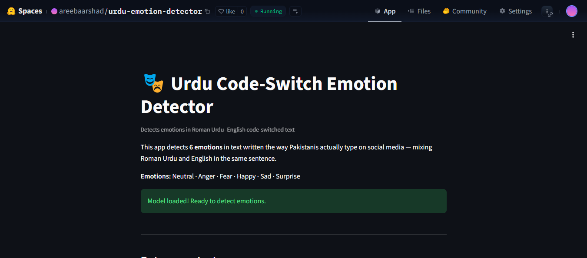
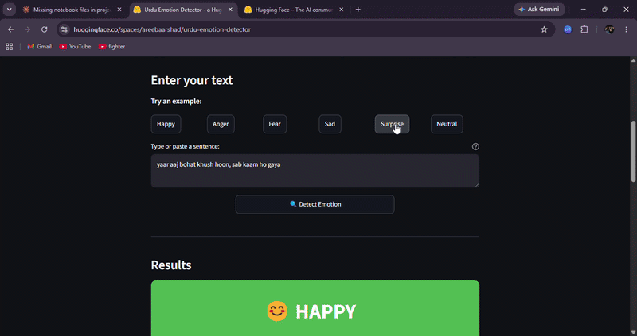

# Urdu Code-Switch Emotion Detector

Detects emotions in Roman Urdu–English code-switched social media text using a fine-tuned XLM-RoBERTa model.

## Demo

<table>
<tr>
<td></td>
<td></td>
</tr>
<tr>
<td align="center"><i>Screenshot</i></td>
<td align="center"><i>Live demo</i></td>
</tr>
</table>

[Live Demo](https://huggingface.co/spaces/areebaarshad/urdu-emotion-detector)

## Dataset

RU-EN-Emotion Corpus — manually annotated Roman Urdu–English code-switched sentences, 6-class emotion taxonomy (Neutral, Anger, Fear, Happy, Sad, Surprise). Source data is a single Excel file (`.xlsx`), Latin script only, no emoji in the original corpus.

> Citation pending verification — confirm exact paper title/venue before publishing this section. Do not cite a source you haven't personally verified.

## Model

`xlm-roberta-base` fine-tuned for 6-class sequence classification, using a 3-phase progressive unfreezing strategy:

- **Phase 1:** Base frozen, classifier head only (LR 2e-3)
- **Phase 2:** Top 2 transformer layers unfrozen (LR 2e-4)
- **Phase 3:** Full model unfrozen, linear warmup scheduler (LR 1e-5)

Each phase uses early stopping (patience-based, monitoring validation macro F1), and only the single best checkpoint is ever saved. Class-weighted cross-entropy loss is used throughout to address severe class imbalance (Fear and Surprise each make up ~1.1% of the data).

Sequences are tokenized to a fixed length of 64 tokens — the empirically measured 95th-percentile token length on the cleaned training text (see `config.py`), not a default.

## Results

Test set (2,931 held-out examples):

| Emotion  | Precision | Recall | F1-score | Support |
|----------|-----------|--------|----------|---------|
| Neutral  | 0.8116    | 0.6008 | 0.6905   | 1706    |
| Anger    | 0.4952    | 0.7045 | 0.5816   | 511     |
| Fear     | 0.0820    | 0.1515 | 0.1064   | 33      |
| Happy    | 0.5832    | 0.7468 | 0.6550   | 549     |
| Sad      | 0.2500    | 0.2871 | 0.2673   | 101     |
| Surprise | 0.2131    | 0.4194 | 0.2826   | 31      |
| **Accuracy** | | | **0.6285** | 2931 |
| **Macro avg** | 0.4058 | 0.4850 | **0.4305** | 2931 |
| Weighted avg | 0.6797 | 0.6285 | 0.6394 | 2931 |

The model performs reasonably on the majority classes (Neutral, Anger, Happy) but is unreliable on Fear and Surprise, which have under 35 test examples each — too few to trust the model's behavior on those classes in production.

## Limitations

Full findings: [`outputs/bias_audit.md`](outputs/bias_audit.md) — 7 audits run against the held-out test set (code-switch ratio sensitivity, gender sensitivity, negation handling, keyword dependency, rare-class reliability, and out-of-distribution robustness). Headline findings:

- **Overall reliability:** Test macro F1 is 0.4305 with 62.85% accuracy — usable for the majority classes, not yet reliable across all six.
- **Fear and Surprise are not production-trustworthy** — both have fewer than 35 test examples, and error analysis suggests part of the error rate reflects genuine label ambiguity (e.g. sarcasm misread as surprise) rather than purely model weakness.
- **Gender sensitivity:** a 10.0% prediction-change rate on gender-swapped neutral sentences (n=50) — a real but moderate fairness gap, not a major failure.
- **Negation handling is inconsistent:** the model passed only 3 of 6 negation test pairs, with failures concentrated in Roman Urdu phrasing specifically — suggesting the model leans on keyword presence rather than full sentence meaning in some cases.
- **Code-switch ratio sensitivity was untestable** on this split — the Low and Medium English-ratio test groups were empty; only High-ratio examples were available.

## How to run locally

```bash
git clone https://huggingface.co/spaces/areebaarshad/urdu-emotion-detector
cd urdu-emotion-detector
pip install -r requirements.txt
streamlit run app.py
```

The app downloads the fine-tuned model from [areebaarshad/urdu-emotion-xlmr](https://huggingface.co/areebaarshad/urdu-emotion-xlmr) on first run.

## What I'd do next

- Fine-tune on scraped Pakistani Twitter/social data to test generalization beyond the original research corpus
- Add emotion intensity scoring (mild vs. strong) rather than a single hard label
- Specifically target Fear and Surprise with additional labeled data — current sample sizes (~30-35 test examples) are too small to draw reliable conclusions about real-world performance on these classes
- Extend to Punjabi–English code-switching, a related but distinct code-mixing pattern common in the same user base
